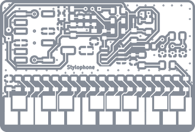

# xTool F2 Ultra

🇩🇪 [Deutsch](README.de.md) · [← Overview](../../README.md)

## Machine data

| | |
|---|---|
| Device (per xTool Studio) | F2 Ultra, device code `GS004-CLASS-4` |
| Laser sources | 60 W MOPA fiber laser (*Fiber IR*) + 40 W diode laser (*Blue light*) |
| Beam steering | galvo |
| Laser class | TODO (rating plate) |
| Connection | USB / Wi-Fi |
| Software | xTool Studio (Windows/macOS), Linux: [see test](software-linux.md) |
| Location | TODO |

## Design rules

See [Design rules](../../docs/en/03-design-rules.md) – KiCad template `Laser_PCB_xTool`.

## Laser parameters (as of 07/2026)

**Source:** xTool project [`presets/stiftklavier-F_Cu.xs`](presets/stiftklavier-F_Cu.xs) from 2026-07-02 (Stiftklavier, single-sided). The values were read directly from the project file.

The project contains **two objects**:

| Object | Source | Processing type |
|---|---|---|
| Copper image + outline (filled compound shape) | `…-F_Cu.dxf` | **Engrave** (fill): removes the copper between the tracks |
| Board outline | `…-Edge_Cuts.dxf` | **Cut**: cuts the board out of the FR4 |

### 1. Remove copper: Engrave (fill)

| Parameter (xTool Studio) | Value |
|---|---|
| Material | user-defined material (saved parameter scheme) |
| Laser type | **Fiber IR** |
| Power | **90 %** |
| Speed | **2400 mm/s** |
| Passes | **10** |
| Lines per cm | **240** (≈ 0.042 mm line spacing) |
| Engraving angle | **45°** |
| Engraving mode | bidirectional (Z mode) |
| Outline tracing | **on** |
| Pulse width | **200 ns** |
| Frequency | **65 kHz** |
| Defocus | off |
| Kerf offset | off |

### 2. Cut out the board: Cut

| Parameter (xTool Studio) | Value |
|---|---|
| Laser type | **Fiber IR** |
| Power | **88 %** |
| Speed | **300 mm/s** |
| Passes | **160** |
| Z step-down | on, stepwise: **0.1 mm every 10 passes** |
| Tabs | on, automatic: **2 tabs, 0.5 mm** |
| Pulse width | **30 ns** |
| Frequency | **130 kHz** |
| Wobble | off |
| Kerf offset | off |

### Project settings

| Setting | Value |
|---|---|
| Processing path | automatic: engrave first, then cut |
| Scan direction | top to bottom |

> **TODO:** add copper and board thickness of the FR4 used. The values only transfer to other boards once these are known.
> **TODO:** double-sided boards not tested yet (alignment when flipping).

Store further project files or material presets in [`presets/`](presets/).

## Workflow

Full guide with every single click: [Manual path: KiCad → xTool](../../docs/en/08-guide-manual.md).

## Solder mask

As of 07/2026: **no working process yet.** Document attempts here.

| Date | Attempt | Result |
|---|---|---|
| | | |
